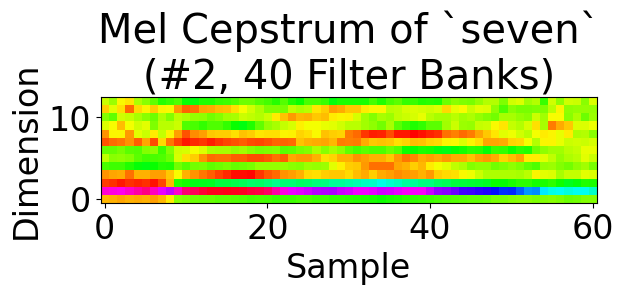
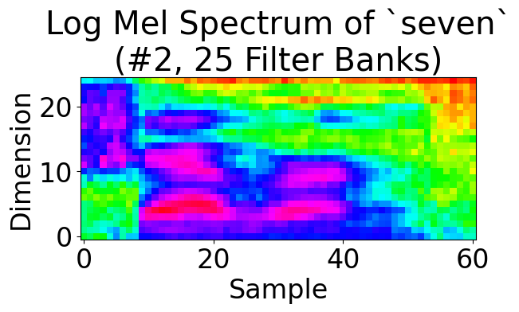

---
presentation:
  width: 1920
  height: 1080
---

<!-- slide -->

# COMPSCI 304 group project 2: MFCC computation

Steven Hé (Sīchàng), Luyao Wang

Instructor: Prof. Ming Li, Haoxu Wang

Duke Kunshan University

<!-- slide -->

### Contents

- Implementation
  - Input audio processing
  - Power spectrum calculation
  - Mel spectrum calculation
  - Mel cepstrum calculation
- Demo

<!-- slide -->

### Input audio processing

- Endpointer
- Segmenter: 20ms half-overlapping
- Streaming fashion

Everything is segmented from now on.

<!-- slide -->

### Power spectrum calculation

- Preemphasis
- Applying window function
- Fast Fourier transform

<!-- slide -->

### Preemphasis

- Reduce the influence of low-frequency components and enhance high-frequency components in a signal.
- Subtract a fraction of the previous sample from the current sample using the formula:

$$ s_{preemp}[n] = s[n] – \alpha s[n-1] $$

<!-- slide -->

### Applying window function

For windowing, the Hanning window function is utilized, defined by the formula:

$$ w[n]= \frac{1}{2}\left[1-\cos \left({\frac {2\pi n}{N}}\right)\right], 0\leq n\leq N$$

Values are cached using `functools.lru_cache`.

<!-- slide -->

### Fast Fourier transform

- Padding to the next power of 2, $N\_{\text{FFT}}$.
- `scipy.fft.fft`
- By Nyquist theorem, throw away data points after the first $\frac{N\_{\text{FFT}}}{2} + 1$.
- Calculate the power spectrum.

<!-- slide -->

## Mel spectrum calculation

- We employ the Slaney-style mel scale calculation formula.
- A linear relationship with respect to Hz below 1000 Hz and transitions to a logarithmic relationship above 1000 Hz.

$$
{\displaystyle m(f)={\begin{cases}{\frac {3f}{200}}&f<1000\\15+27\log _{6.4}\left({\frac {f}{1000}}\right)&f\geq 1000\end{cases}}}
$$

We multiply the power spectrum by the Mel filter banks matrix (also cached) to weight each power spectral value by the corresponding filter's value at that frequency.

<!-- slide -->

### Mel banks matrix for 40 filters (0~8000Hz)

<!-- slide -->

## Mel cepstrum calculation

- DCT-II matrix for Mel cepstrum calculation
- Multiply the DCT matrix with the Mel spectrum.
- Select the first 13 coefficients as the Mel Frequency Cepstral Coefficients (MFCCs).
- Inverse Discrete Cosine Transform (IDCT) to convert Mel cepstrum back to Mel spectrum.

$$
{\displaystyle X_{k}=\sum _{n=0}^{N-1}x_{n}\cos \left[\,{\tfrac {\,\pi \,}{N}}\left(n+{\tfrac {1}{2}}\right)k\,\right]\qquad {\text{ for }}~k=0,\ \dots \ N-1~.}
$$

<!-- slide -->

## Result

    
    
    

Extracted from $3\times 3\times 4\times 11$ generated plots for zero through ten.

<!-- slide -->

# Demo
