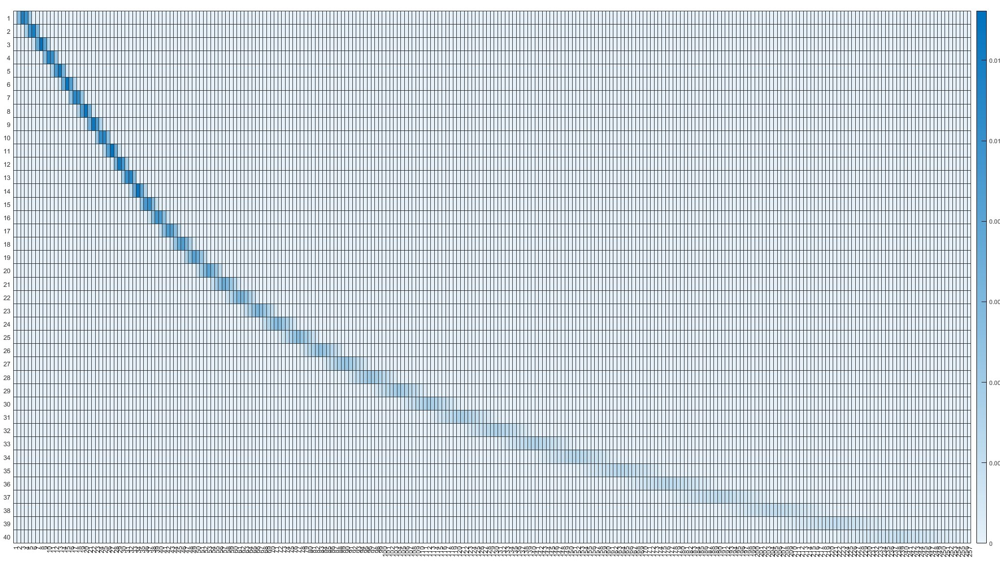
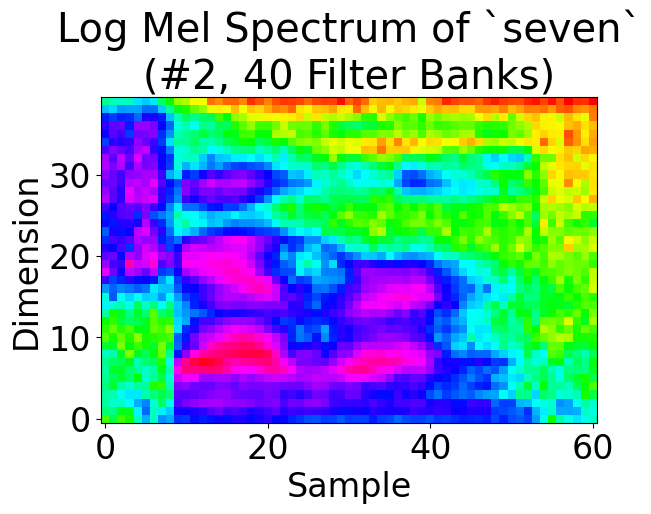
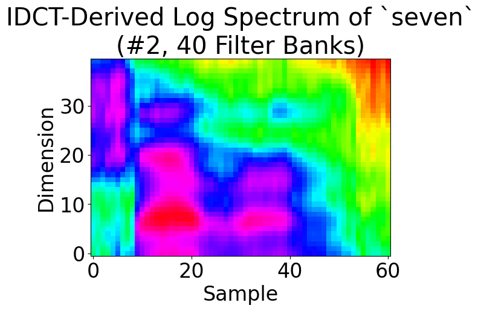

# Project 2 Report

In this project, the goal is to develop a function for computing Mel-frequency Cepstral Coefficients (MFCC) from audio recordings of multiple instances of digits. The computed MFCC will be used to analyze and visualize the similarities between different instances of the same word.

## Input audio processing

The input audio is processed in a streaming manner for online processing in the future. An endpointer is adopted from project 1, and its output is sent via a queue to the segmenter.

To facilitate further analysis, we employ a segmenter to divide the collected audio signal into 20ms half-overlapping segments. The segmenter persists the audio signal not consumed so it can be used later.

## Power spectrum calculation

### Preemphasis

Preemphasis is employed to reduce the influence of low-frequency components and enhance high-frequency components in a signal. This technique involves subtracting a fraction of the previous sample from the current sample using the formula:

$$ s_{preemp}[n] = s[n] – \alpha s[n-1] $$

In signals with high sampling rates, adjacent samples in low-frequency signals often exhibit similar values due to their slow variation over time. By subtracting the fraction, we remove the portion of the samples that remain unchanged compared to their adjacent samples. This operation isolates the rapidly changing portion of the signal, which represents its high-frequency components.

### Windowing

For windowing, the Hanning window function is utilized, defined by the formula:

$$ w[n]= \frac{1}{2}\left[1-\cos \left({\frac {2\pi n}{N}}\right)\right], 0\leq n\leq N$$

Window functions are important in signal processing as they mitigate the spectral leakage effect and improve the accuracy of frequency analysis. Overlapping segments, in conjunction with window functions, can enhance the frequency resolution of the analysis. By incorporating overlapping segments, the frequency components of the signal are captured more frequently, allowing for a more detailed analysis of rapidly changing frequencies.

Since the windowing function used is usually the same, we cache it using `functools.lru_cache` to avoid repetitive computation.

### Fast Fourier transform

Following preemphasis and the application of the window function to the overlapping segments, we employ the Fast Fourier Transform (FFT) algorithm. We first pad the segment with zeros at the end so its length is the next power of 2, then utilize the FFT implementation from the `scipy.fft.fft` module to convert the time series into the frequency series. In accordance with the Nyquist theorem, we only consider the first $\frac{N_{\text{FFT}}}{2} + 1$ output data points. By taking the squares of the absolute values of these data points, we calculate the power spectrum, which represents the intensity or magnitude of the signal at various frequencies.

## Mel spectrum calculation

We employ the Slaney-style mel scale calculation formula, which exhibits a linear relationship with respect to Hz below 1000 Hz and transitions to a logarithmic relationship above 1000 Hz. The formula is as follows:

$$
{\displaystyle m(f)={\begin{cases}{\frac {3f}{200}}&f<1000\\15+27\log _{6.4}\left({\frac {f}{1000}}\right)&f\geq 1000\end{cases}}}
$$

Mel banks matrix for 40 filters.

This formula maps frequencies $f$ to the mel scale $m(f)$. The mel scale is a perceptual scale that approximates the human perception of pitch.

We multiply the power spectrum by the Mel filter banks matrix to weight each power spectral value by the corresponding filter's value at that frequency.

Furthermore, we normalize the filter banks matrix to ensure that the sum of each row is equal to 1. This normalization is performed to preserve the overall energy of the signal during the transformation.

The provided image displays an example of a Mel banks matrix with 40 filters. Each row represents a mel filter, and the columns represent the spectral bins in the power spectrum. We also tried 30 and 25 filter banks.

## Mel cepstrum calculation

For the computation of the Mel cepstrum, we opted to use the DCT-II matrix, which is defined by the following formula:

$$
{\displaystyle X_{k}=\sum _{n=0}^{N-1}x_{n}\cos \left[\,{\tfrac {\,\pi \,}{N}}\left(n+{\tfrac {1}{2}}\right)k\,\right]\qquad {\text{ for }}~k=0,\ \dots \ N-1~.}
$$

To obtain the dimension-reduced Mel cepstrum, we multiplied the DCT matrix with the Mel spectrum. From the resulting values, we selected the first 13 coefficients as the Mel Frequency Cepstral Coefficients (MFCCs). It is a valuable technique in various applications such as speech analysis, audio processing, and feature extraction.

To convert the Mel cepstrum back to the Mel spectrum, we can apply the inverse Discrete Cosine Transform (IDCT). The IDCT is the inverse operation of the DCT and enables us to transform the cepstral coefficients back into the original spectral domain. It's important to note that during this conversion, the reconstructed Mel spectrum may appear smoother compared to the original spectrum. This is because some information is lost during the dimension reduction process, but the overall trend of the spectrum is preserved.

    
    

In the provided images above, you can observe the process of converting the Mel cepstrum back to the Mel spectrum using the IDCT. The first image depicts the log mel spectrum of the word "seven," while the second image represents the log mel spectrum reconstructed by applying the IDCT to the Mel cepstrum. As you can see, the reconstructed spectrum closely resembles the original spectrum, albeit with a smoother appearance.

## Conclusion

In this project, we developed functions to compute Mel-frequency Cepstral Coefficients (MFCC) from audio recordings. Through this project, we gained practical knowledge of FFT calculation and important concepts such as pre-emphasizing, windowing, and overlapping samples. We also learned how to utilize Mel filter banks to simulate the frequency response of the human ear and employ Discrete Cosine Transform (DCT) and Inverse DCT (IDCT) for dimension reduction/reconstruction. The objective was to analyze the similarities between different instances of the same word based on their MFCC representations. By varying the number of Mel spectral filters, we observed the effects on the visual patterns. This project provides insights into the similarities between different instances of the same word based on their MFCC representations, which is crucial for further projects in speech recognition.
