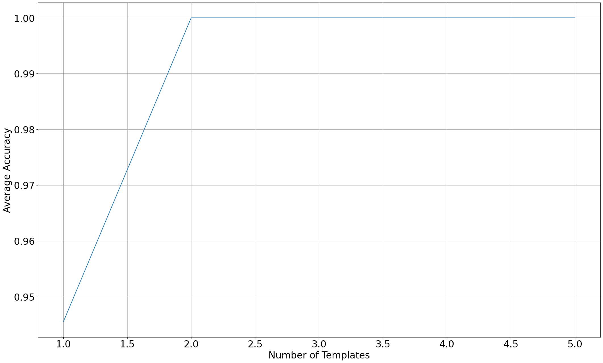
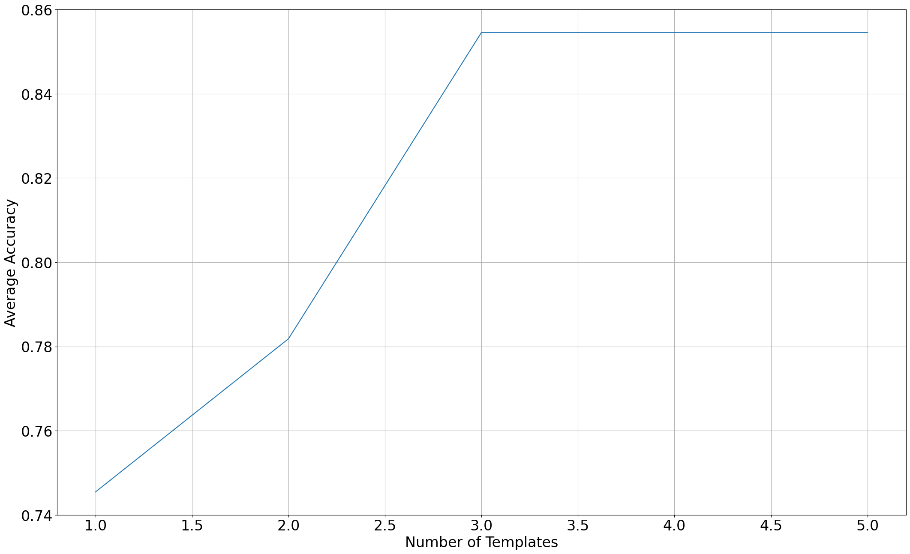

---
presentation:
  width: 1920
  height: 1080
---

<!-- slide -->

# COMPSCI 304 group project 3: DTW and HMM for digits recognition

Steven Hé (Sīchàng), Luyao Wang

Instructor: Prof. Ming Li, Haoxu Wang

Duke Kunshan University

<!-- slide -->

### Contents

- Dynamic Time Warping (DTW)
  - DTW With Single Templates
  - Pruning for DTW
  - DTW With Five Templates
- Hidden Markov Model (HMM)
  - Segmental K-means for training HMM
  - HMM with  Gaussian mixture
- Demo

<!-- slide -->

### Dataset

- Hard dataset
  - Labeled with indexes 0 through 9
  - We intentionally recorded each instance differently
- Easy dataset
  - Labeled with indexes 10 through 19
  - The instances are very similar to each other

<!-- slide -->

### DTW With Single Templates

- node cost: Euclidean distance between the input sample and the template
- normalized by the length of the template
- selection of DTW finish costs used for comparison
  - minimum finish costs
  - last finish costs
  - first finish costs

<!-- slide -->

### Result for DTW With Single Templates

- minimum finish costs

| Number   | zero | one | two | three | four | five | six | seven | eight | nine | ten | Average |
| -------- | ---- | --- | --- | ----- | ---- | ---- | --- | ----- | ----- | ---- | --- | ------- |
| Accuracy | 1.0  | 1.0 | 0.6 | 1.0   | 1.0  | 0.8  | 1.0 | 1.0   | 1.0   | 1.0  | 1.0 | 0.95    |

- last finish costs

| Number   | zero | one | two | three | four | five | six | seven | eight | nine | ten | Average |
| -------- | ---- | --- | --- | ----- | ---- | ---- | --- | ----- | ----- | ---- | --- | ------- |
| Accuracy | 1.0  | 1.0 | 0.6 | 1.0   | 1.0  | 0.6  | 0.6 | 0.8   | 1.0   | 1.0  | 1.0 | 0.87    |

- first finish costs

| Number   | zero | one | two | three | four | five | six | seven | eight | nine | ten | Average |
| -------- | ---- | --- | --- | ----- | ---- | ---- | --- | ----- | ----- | ---- | --- | ------- |
| Accuracy | 0.0  | 0.0 | 0.0 | 0.0   | 0.8  | 1.0  | 0.6 | 0.0   | 0.0   | 0.2  | 0.0 | 0.24    |

<!-- slide -->

### Pruning for DTW

- Round minimum cost after each round of comparison

The best pruning threshold seems to be 13

<!-- slide -->

### DTW With Five Templates

When adding more templates (12, 14, 16, 18), the accuracy increased and quickly reached 1.

<!-- slide -->

### DTW With Five Templates

- The "hard" recordings with indexes 0 through 9.
- Accuracy was lower
- Increased accuract as we added more templates

<!-- slide -->

### Segmental K-means for training HMM

1. Initialize all parameters uniformly:
   1. Initialize state means and covariances.
   2. Initialize transition probabilities.
2. Segment all training sequences.
3. Reestimate the parameters from segmented training sequences:
   1. Update state means and covariances based on the segmented sequences.
   2. Update transition probabilities based on the segmented sequences.
4. If the segmenting is not the same as last round, go back to step 2 and repeat the process.

<!-- slide -->

### Transition probabilities

The transition probabilities are derived from the sequences segmented into states using the following formula:
$$ P_{ij} = \frac{\sum_k N_{k, i, j}}{\sum_k N_{k, i}} $$
where:

- $N_{k, i}$ is the number of vectors in the ith segment (state) of the kth training sequence
- $N_{k, i, j}$ is the number of vectors in the ith segment (state) of the kth training sequence that were followed by vectors from the jth segment (state)

<!-- slide -->

### Emission probabilities

- Determined using the Gaussian distribution for each state 
- Calculate the probability density function (PDF) of the input feature vector using the state mean and covariance.

<!-- slide -->

### Optimizing performance

- Diagonal covariance matrix to simplify multivariate Gaussian pdf:

$$ f(x) = \frac{1}{\sqrt{(2\pi)^D \prod\limits_d \sigma_d^2}} \exp \Bigl(-0.5\sum_d \frac{(x_d - \mu_d)^2}{\sigma_d^2}\Bigr) $$

- Evaluate multivariate Gaussian pdf only when the transition probability and Viterbi trellis of the last time step are valid.

<!-- slide -->

### HMM with Gaussian mixture

1. Initialize all parameters uniformly and train HMMs with a single Gaussian:
   1. Initialize state means and covariances with a single Gaussian.
   2. Initialize transition probabilities.
2. Segment all training sequences.
3. Reestimate the parameters from segmented training sequences:
   1. Update state means and covariances based on the segmented sequences.
   2. Update transition probabilities based on the segmented sequences.
4. _Split_ the Gaussians in the state output distributions to obtain a larger Gaussian mixture at each state.
5. Use the K-means algorithm to find clusters of Gaussians for each state (Not using EM for GMM for simplicity as suggested in assignment specification).
6. If the convergence criterion is not met, go back to step 2 and repeat the process.

<!-- slide -->

### HMM with Gaussia mixture

- Instead of having a single Gaussian distribution for each state
- Represent the emission probabilities as a mixture of multiple Gaussian distributions.
- Each state contains a Gaussian mixture model
- Eission probability is calculated by selecting the Gaussian component with the highest probability within that segmented state.

<!-- slide -->

### Splitting Gaussians

$$
\begin{align*}
    y_n^+ &= y_n ( 1 + \epsilon  ) \\
    y_n^- &= y_n ( 1 - \epsilon  )
\end{align*}
$$

where $y_n$ represents a Gaussian and $\epsilon$ is set to 0.1.
At each iteration, we increase the number of Gaussians by a power of 2, resulting in 1, 2, 4, 8, and so on Gaussians.

<!-- slide -->

### Result for "easy" dataset

HMM with 1, 2, 4 Gaussians perform equally well:
| Number | zero | one | two | three | four | five | six | seven | eight | nine | ten | Average |
| -------- | ---- | --- | --- | ----- | ---- | ---- | --- | ----- | ----- | ---- | --- | ------- |
| Accuracy | 1.0 | 1.0 | 1.0 | 1.0 | 1.0 | 1.0 | 0.8 | 1.0 | 1.0 | 1.0 | 1.0 | 0.98 |

<!-- slide -->

### Result for "hard" dataset

HMM with 1 Gaussian:
| Number | zero | one | two | three | four | five | six | seven | eight | nine | ten | Average |
| -------- | ---- | --- | --- | ----- | ---- | ---- | --- | ----- | ----- | ---- | --- | ------- |
| Accuracy | 1.0 | 1.0 | 0.6 | 0.8 | 0.8 | 0.6 | 0.6 | 0.6 | 0.6 | 1.0 | 1.0 | 0.78 |

HMM with 2 Gaussian:
| Number | zero | one | two | three | four | five | six | seven | eight | nine | ten | Average |
| -------- | ---- | --- | --- | ----- | ---- | ---- | --- | ----- | ----- | ---- | --- | ------- |
| Accuracy | 1.0 | 1.0 | 0.4 | 0.8 | 1.0 | 0.8 | 0.8 | 0.8 | 0.4 | 1.0 | 1.0 | 0.82 |

HMM with 4 Gaussian:
| Number | zero | one | two | three | four | five | six | seven | eight | nine | ten | Average |
| -------- | ---- | --- | --- | ----- | ---- | ---- | --- | ----- | ----- | ---- | --- | ------- |
| Accuracy | 1.0 | 1.0 | 0.4 | 1.0 | 0.6 | 0.4 | 0.6 | 0.8 | 0.6 | 1.0 | 1.0 | 0.76 |

- HMM might be overfitting when number of Gaussians increase
- Small training sample size
- Include more diverse training data in the future projects

<!-- slide -->

## Demo

