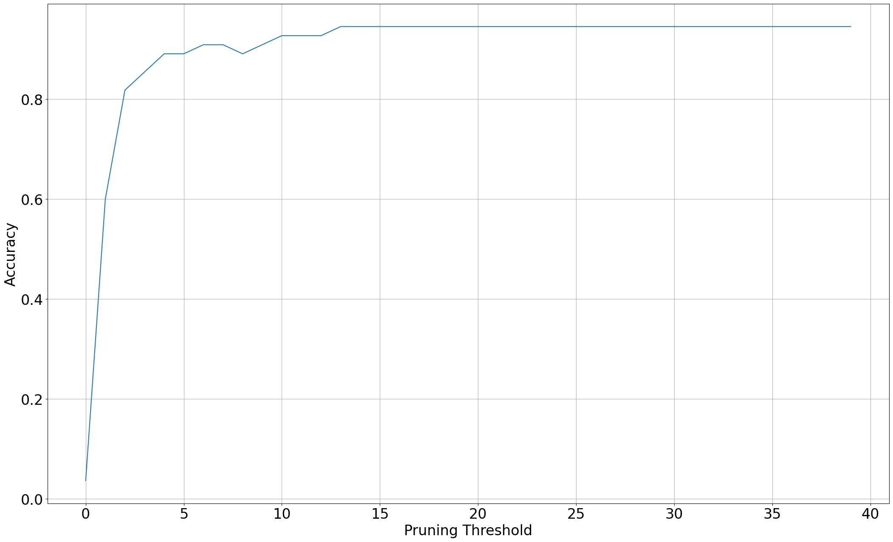
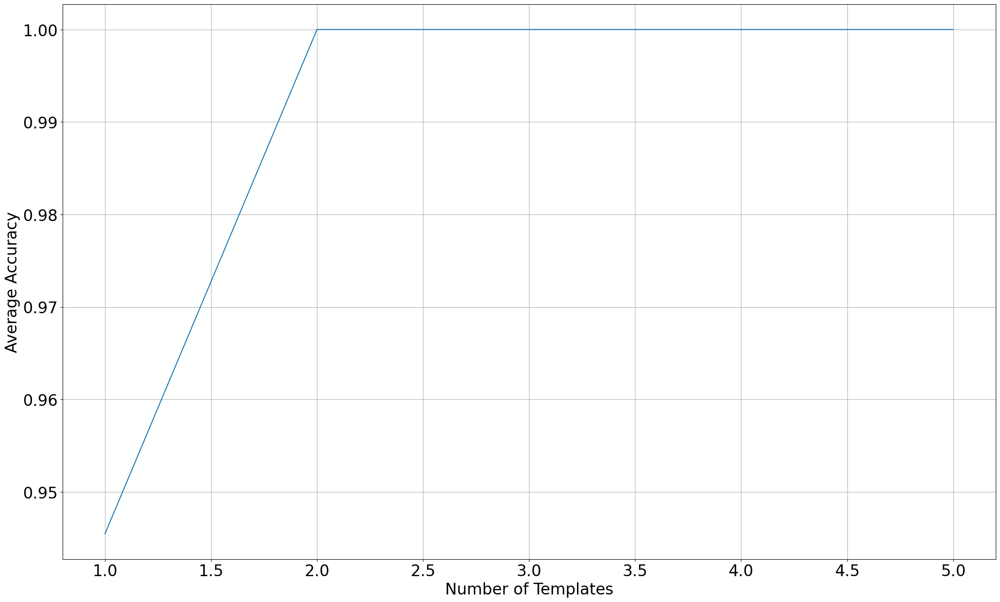
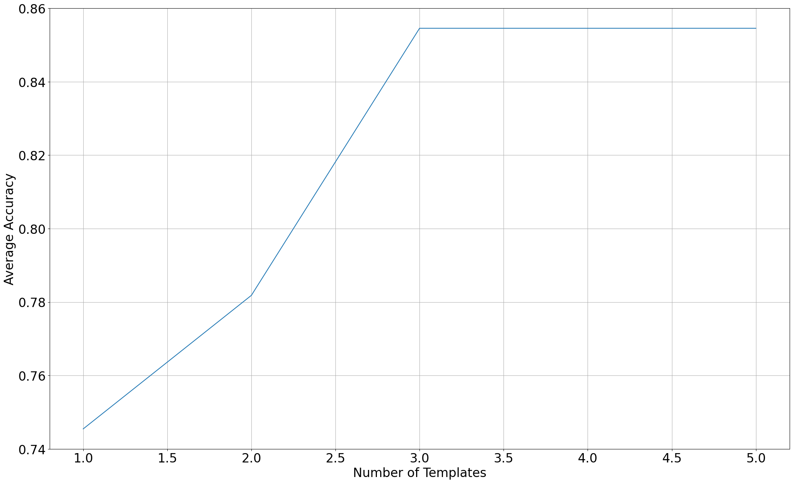
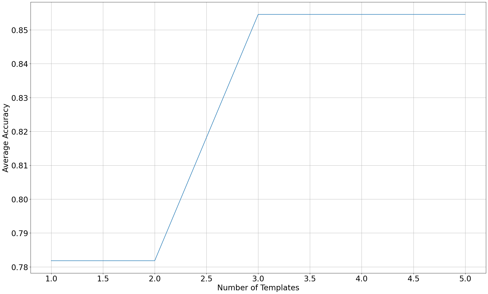

# Project 3 Report

In DTW, the node cost is set as the Euclidean distance between the input sample and the template, normalized by the length of the template to mitigate the effect of differences template lengths on the cumulative costs.

We recorded number zero through ten 10 times each, labeled with indexes 0 through 9. Steven recorded 0~4 and Luyao recorded 5~9. We started with the number recordings with index 0, and attempted to test them against recordings 1, 3, 5, 7, and 9. However, since we intentionally recorded each instance differently, the recognition was too difficult and the accuracies were low, at only about 0.33. Steven re-recorded 10 similar instances for each number, labeled them indexes that are 10 larger than the previous set, and used them to test the DTW model.

Single DTW, taking the minimum finish costs of each template for comparison to decide which template is the best match:

Number|zero|one|two|three|four|five|six|seven|eight|nine|ten|Average
-|-|-|-|-|-|-|-|-|-|-|-|-
Accuracy|1.0|1.0|0.6|1.0|1.0|0.8|1.0|1.0|1.0|1.0|1.0|0.95

By taking the last finish costs:

Number|zero|one|two|three|four|five|six|seven|eight|nine|ten|Average
-|-|-|-|-|-|-|-|-|-|-|-|-
Accuracy|1.0|1.0|0.6|1.0|1.0|0.6|0.6|0.8|1.0|1.0|1.0|0.87

By taking the first finish costs:

Number|zero|one|two|three|four|five|six|seven|eight|nine|ten|Average
-|-|-|-|-|-|-|-|-|-|-|-|-
Accuracy|0.0|0.0|0.0|0.0|0.8|1.0|0.6|0.0|0.0|0.2|0.0|0.24

On average, taking the minimum finish costs gave the best accuracy, therefore we continued with this method for the time-synchronous DTW. However, the sample size is too small to draw a conclusion.

Best pruning threshold seems to be 13, according to Figure 1.

When adding more templates (12, 14, 16, 18), the accuracy increased and quickly reached 1, as shown in Figure 2.

Therefore, we reverted to using the initial recordings with indexes 0 through 9, which we refer to as hard mode. As shown in Figure 3, the accuracy was lower, and increased as we added Steven's recordings 2 and 4 as templates. This is because Steven's recordings vary significantly, and the added templates contributed to the model.

The above results are obtained using the best pruning threshold we determined earlier. If we remove the threshold, we get very similar results, as shown in Figure 4.

## Problem 2:

### Training

To train the Hidden Markov Model (HMM) for the digits, we follow the following steps:

1. Initialize all parameters uniformly:
   1. Initialize state means and covariances.
   2. Initialize transition probabilities.
2. Segment all training sequences.
3. Reestimate the parameters from segmented training sequences:
   1. Update state means and covariances based on the segmented sequences.
   2. Update transition probabilities based on the segmented sequences.
4. If the convergence criterion is not met, go back to step 2 and repeat the process.

### Prediction

After training the HMM model for each of the digits (0 to 10), we can make predictions using the following steps:

1. Feed the test sample into each of the HMM models.
2. Calculate the log probability for each HMM model.
3. Select the number associated with the highest log probability as the predicted number.

### Implementation details

#### Viterbi decoding

We utilize the dynamic programming Viterbi decoding algorithm to find the best observed sequence of the HMM.
The transition probabilities are derived from the sequences segmented into states using the following formula:
$$ P_{ij} = \frac{\sum_k N_{k, i, j}}{\sum_k N_{k, i}} $$
where:

- $N_{k, i}$ is the number of vectors in the ith segment (state) of the kth training sequence
- $N_{k, i, j}$ is the number of vectors in the ith segment (state) of the kth training sequence that were followed by vectors from the jth segment (state)

The emission probabilities are determined using the Gaussian distribution for each state. We calculate the probability density function (pdf) of the input feature vector using the state mean and covariance.

We keep track of the best score (log probability) for each state at each time, and then backtrack to find the optimal trace by following the states with the highest scores at each time.

#### Result

Number|zero|one|two|three|four|five|six|seven|eight|nine|ten|Average
-|-|-|-|-|-|-|-|-|-|-|-|-
Accuracy|1.0|1.0|0.6|1.0|1.0|0.8|1.0|1.0|1.0|1.0|1.0|0.95

## Problem 3:

In addition to the routine followed in problem 2, we introduce the following modification:

1. Initialize all parameters uniformly and train HMMs with a single Gaussian:
   1. Initialize state means and covariances with a single Gaussian.
   2. Initialize transition probabilities.
2. Segment all training sequences.
3. Reestimate the parameters from segmented training sequences:
   1. Update state means and covariances based on the segmented sequences.
   2. Update transition probabilities based on the segmented sequences.
4. _Split_ the Gaussians in the state output distributions to obtain a larger Gaussian mixture at each state.
5. Use the K-means algorithm to find clusters of Gaussians for each state (Not using EM for GMM for simplicity as suggested in assignment specification).
6. If the convergence criterion is not met, go back to step 2 and repeat the process.

### Implementation details

#### Splitting Gaussians

To split the Gaussians, we use the following formula:

$$
\begin{align*}
    y_n^+ &= y_n ( 1 + \epsilon  ) \\
    y_n^- &= y_n ( 1 - \epsilon  )
\end{align*}
$$

where $y_n$ represents a Gaussian and $\epsilon$ is set to 0.1.
At each iteration, we increase the number of Gaussians by a power of 2, resulting in 1, 2, 4, 8, and so on Gaussians.

#### Emission probabilities with Gaussian mixture

Instead of having a single Gaussian distribution for each state, we represent the emission probabilities as a mixture of multiple Gaussian distributions. Each state contains a Gaussian mixture model, and the emission probability is calculated by selecting the Gaussian component with the highest probability within that segmented state.

This approach allows for capturing the complexities and variations in the observed data by modeling them with multiple Gaussian distributions within each state.

#### Result (4 Gaussians)

Number|zero|one|two|three|four|five|six|seven|eight|nine|ten|Average
-|-|-|-|-|-|-|-|-|-|-|-|-
Accuracy|1.0|1.0|0.8|1.0|1.0|1.0|0.8|1.0|1.0|1.0|1.0|0.96