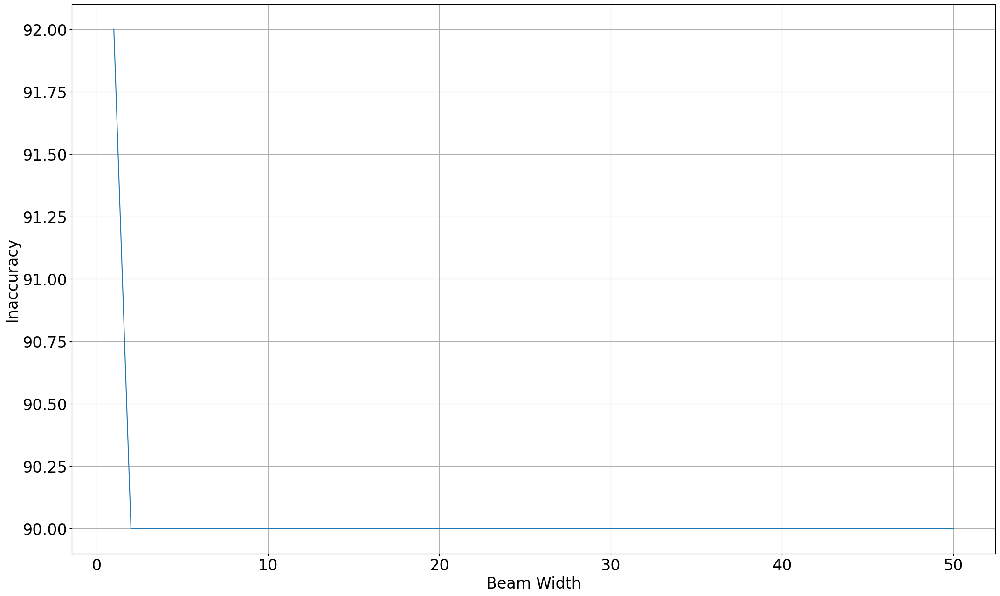

---
presentation:
  width: 1920
  height: 1080
---

<!-- slide -->

# COMPSCI 304 group project 4: Text Segmentation and Spellcheck with Lexical Tree

Steven Hé (Sīchàng), Luyao Wang

Instructor: Prof. Ming Li, Haoxu Wang

Duke Kunshan University

<!-- slide -->

### Contents

- Lexical tree
  - Spellcheck against words
- Text Segmentation And Spellcheck
  - Segment text
  - Segment and spellcheck text

<!-- slide -->

### Lexical tree

- Each trie node represents a character
- Trie node
  - Parent node
  - Children, `None` if leaf
  - an associated value, `None` if root

- Children dictionary key: `(is_leaf, value)`
  - $O(1)$ query for leaf/ non-leaf nodes

<!-- slide -->

### Lexical tree

```
Trie(len=7):
*─a
├─a─n
│ ├─n─d
│ └─p─p─l─e
└─b─a─n─a─n─a
    ├─t
    └─t─t─l─e
```

</br>

<!-- slide -->

### Spellchecking

- Similar procedures to Levenshtein distance with dynamic programming
- Flatten the lexical tree, transforming the tree structure into a linear sequence.

```
*─b─a─n─a─n─a
    ├─t
    └─t─t─l─e
```

→ `[root, b, a1, n, t1, t2, a2, t3, n2, l, a3, e]`

- Breadth-first: parents appears before children
  - Important when traversing

<!-- slide -->

### Dynamic Programming

Three possible operations at each character position:

1. → Stay (move from *left* in the trellis): The tree remains at the current position with loss `left_loss`.
2. ↗ Advance (move *diag*onal in the trellis): The tree moves to the next layer or level with loss `diag_loss` if character does not match.
3. ↑ Skip (move from _down_ in the trellis): The tree skips that particular character with loss `down_loss`.

These loss parameters can be adjusted to obtain better result.

<!-- slide -->

### Dynamic Programming

- "Loss node": keep track of the trellis
    - Current loss value
    - Reference to corresponding trie node
- Dictionary trie nodes → loss nodes
    - during each round of traversal

<!-- slide -->

### Beam search

- Only consider the loss nodes that have a loss value smaller than the minimum loss of the current round plus the specified beam width
- We use fixed beam width 3 in the first task spellchecking against words

<!-- slide -->

### Spellcheck Backtracking

- Optimal loss obtained at the end of the target word
- Backtrack the loss node to identify the best matching string
- Iteratively finding the parent of the trie node associated with each loss node

<!-- slide -->

### Spellcheck Result

Raw typo text:

```
onse apon a tyme wile gramadatta ws kng of benares th bohisata kame to lif t the foot of he himlays as ...
```

Ground truth text:

```
once upon a time while brahmadatta was king of benares the bodhisatta came to life at the foot of the himalayas as ...
```

Corrected text:

```
one upon a time wide brahmadatta as ing of benares oh bodhisatta came to if a the foot of he hillas as a ...
```

- 74.39% of the words are correctly matched
- Levenshtein distance to the ground truth of 28
- Suffering from words that have the same Levenshtein distance to the typo text as the correct words have (once to onse and one are all 1 in Levenshtein distance).

<!-- slide -->

## Text Segmentation And Spellcheck

- The approach used for segmentation and segmentation with spellcheck is the same
- To accommodate for multiple words, each loss node also refers to the previous loss node in addition to the corresponding trie node
- The approach allows for backtracking of all the words
- A new loss node is created when the previous one reaches a leaf trie node, and it is "teleported" to the root node while referring to the previous loss node
- Similar to continuous speech recognition using Hidden Markov Models (HMMs)

<!-- slide -->

### Text Segmentation Result

The unsgegmented text:

```
onceuponatimewhilebrahmadattawaskingofbenaresthebodhisattacametolifeatthefootofthehimalayasasa ...
```

Segmentation result:

```
once upon a time while brahmadatta was king of benares the bodhisatta came to life at the foot of the himalayas as a ...
```

- Calculate an "inaccuracy" as the Levenshtein distance between each line of the ground truth and our segmentation result to avoid the inconsistencies resulted from alignments.
- The inaccuracy for our segmentation result is 7.

<!-- slide -->

### Text Segmentation And Spellchecking Result

The unsegmented typo text:

```
onseaponatymewilegramadattawskngofbenaresthbohisatakametoliftthefootofhehimlaysasa ...
```

Segmentation and spellchecking result:

```
on sea porath mew i le brahmadatta waking of benares the oh i sat a kamen to lilt the foot of he him ways as a ...
```

The inaccuracies of our segmentation and spellchecking results are all 90 when we use beam widths 5, 10, and 15.

<!-- slide -->

### Inaccuracy And Beam Width



Beam width of 2 is empirically the optimal choice.

<!-- slide -->

### Variations to Procedure - 1

- Words with the same Levenshtein distances
- Typo norms
    - Adjust `left_loss`, `diag_loss`, and `down_loss`
    - Negative effect

<!-- slide -->

### Variation to Procedure - 2

- Words split into smaller parts: eat → e at
- Additional penalty to transition between words

<!-- slide -->


`left_loss`, `diag_loss`, `down_loss` = 16, beam width = 32

<!-- slide -->

## Demo
