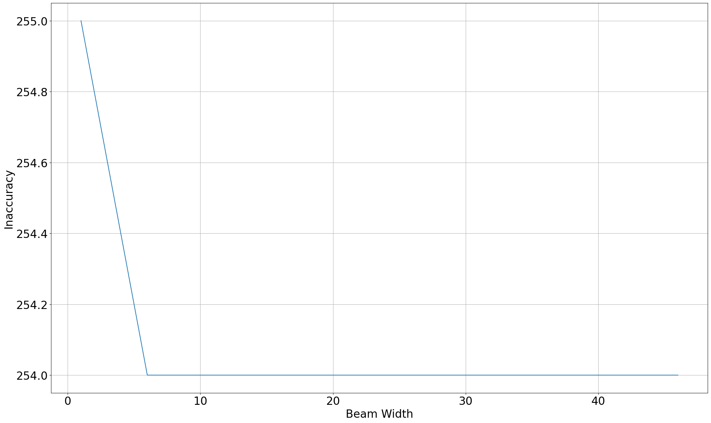

# Project 4 Report

## Lexical tree

We construct a trie structure for the lexical tree.

Each trie node represents a character. A node has a parent, a list of children, and an associated value. We use `None` in place of the children list to indicate that the node is a leaf node corresponding to the end of a word. We use `None` in place of the value for the dummy node prepended at the beginning of all words.

Leaf nodes and non-leaf nodes are distinguished within each node's children. The children dictionary uses `(is_leaf, value)` as keys, where `is_leaf` is whether the child node is a leaf node, and `value` is the child node's value. This allows us to query either leaf or non-leaf nodes in $O(1)$.

### Debugging the trie

To check the correctness of the trie, we implemented a `__repr__` method to print the trie in a human-readable format. For example, one of the test cases is a trie containing the words `banana`, `bat`, `battle`, `a`, `an`, `and`, and `apple`. The trie is printed as follows:

```
Trie(len=7):
*─a
├─a─n
│ ├─n─d
│ └─p─p─l─e
└─b─a─n─a─n─a
    ├─t
    └─t─t─l─e
```

## Spellchecking

In order to facilitate techniques similar to Levenshtein distance with dynamic programming, we employ a process of flattening the lexical tree. This involves transforming the tree structure into a linear sequence. For instance, the given tree:

```
*─b─a─n─a─n─a
    ├─t
    └─t─t─l─e
```

would be flattened as trie nodes with values `[root, b, a1, n, t1, t2, a2, t3, n2, l, a3, e]`. Our flattening strategy is breadth-first, which ensures that each node's parent node would appear before the node itself in the sequence. This is important for the dynamic programming later.

During the process of generating the target word, we consider three possible operations at each character position:

1. Stay (move from *left* in the trellis): The tree remains at the current position with loss `left_loss`.
2. Advance (move *diag*onal in the trellis): The tree moves to the next layer or level with loss `diag_loss` if character does not match.
3. Skip (move from *down* in the trellis): The tree skips that particular character with loss `down_loss`.

These loss parameters default to 1, but can be adjusted to obtain better result.

To traverse the trie and find the best match, we introduce a data type called loss node. During each round of traversal, we maintain a dictionary from trie nodes to loss nodes. A loss node contains the current loss value and the references to the corresponding trie node, which help us backtrack the search to obtain the recognized word.

In each round, we attempt to generate a new loss nodes for each trie node. A previous loss node among *left*, *diag*, and *down* on the trellis is chosen based on the resulting next cost following the classic string matching algorithm; the new loss node is created based on this previous loss node with the updated trie node and the added loss.

To improve efficiency and reduce computational complexity, we employ beam search for pruning at each round. This means that we only consider the loss nodes that have a loss value smaller than the minimum loss of the current round plus the specified beam width. In this experiment, we used a fixed beam width of 3.

### Spellcheck Backtracking

After obtaining an optimal loss at the end of the target word, we perform backtracking through the best loss node that corresponds to a leaf trie node, to identify the best matching string. Starting from the trie node referred to by the best loss node, we backtrack to the root node iteratively, find all characters in the way, and reverse their order to obtain the matched word.

### Spellcheck Result

Raw typo text:

```
onse apon a tyme wile gramadatta ws kng of benares th bohisata kame to lif t the foot of he himlays as ...
```

Ground truth text:

```
once upon a time while brahmadatta was king of benares the bodhisatta came to life at the foot of the himalayas as ...
```

Corrected text:

```
one upon a time wide brahmadatta as ing of benares oh bodhisatta came to if a the foot of he hillas as a ...
```

74.39% of the words are correctly matched, resulting in a Levenshtein distance to the ground truth of 28. As we can see, the spellcheck result suffers from words that have the same Levenshtein distance to the typo text as the correct words have. We could leverage grammar and prior word-transition probabilities to improve the result, but since we do not have any training data for those options, we did not try those ideas.

## Text Segmentation And Spellcheck

We use the same approach to segment and to segment with spellcheck.

For the text segmentation, we utilize a modified approach based on spellchecking to accommodate for multiple words. Besides the corresponding trie node, each loss node also refers to the previous loss node to help us backtrack all the words. A new loss node is created only when the previous one reaches a leaf trie node; in this case, the new loss node is "teleported" to the root node, and refers to the previous loss node. This teleportation behavior is disabled for single-word matching and matching the last character so the single words and last characters correctly result in leaf trie nodes.

This modification enables us to adapt the spellchecking procedure for sentence segmentation. The concept is similar to continuous speech recognition using Hidden Markov Models (HMMs). By leveraging this modified approach, we can achieve sentence segmentation with minimal adjustments to the spellchecking mechanism.

### Text Segmentation Result

The unsgegmented text:

```
onceuponatimewhilebrahmadattawaskingofbenaresthebodhisattacametolifeatthefootofthehimalayasasa ...
```

Segmentation result:

```
once upon a time while brahmadatta was king of benares the bodhisatta came to life at the foot of the himalayas as a ...
```

Instead of calculating the "accuracy" as "difference in the number of words in the hypothesized segmentation and the number of words in the correct transcription PLUS the number of misspelled words", we calculate an "inaccuracy" as the Levenshtein distance between each line of the ground truth and our segmentation result, to avoid the inconsistencies resulted from alignments. The inaccuracy for our segmentation result is 7.

### Text Segmentation And Spellchecking Result

The unsegmented typo text:

```
onseaponatymewilegramadattawskngofbenaresthbohisatakametoliftthefootofhehimlaysasa ...
```

Segmentation and spellchecking result:

```
on sea porath mew i le brahmadatta waking of benares the oh i sat a kamen to lilt the foot of he him ways as a ...
```

The inaccuracies of our segmentation and spellchecking results are all 90 when we use beam widths 5, 10, and 15.

#### Inaccuracy And Beam Width



We studied the relationship between accuracy and the beam width used. As Figure 1 illustrates, as the beam width increases to 2, the number of inaccuracies drops down from 92 to 90. Further increasing the beam width does not improve the inaccuracy, showing that the beam width of 2 is empirically already the optimal choice.

### Variation to Procedure - 1

The inaccuracy of our segmentation and spellchecking procedure is high. The main reason is the that it suffers from the same problem our spellchecking procedure faces, words that have the same Levenshtein distances.

To improve the procedure, we first came up with the idea to differentiate the loss between *left*, *diag* and *down* movements. Observing that people most frequently type the wrong character (replacement), or less frequently touch additional keys when typing, we want to accordingly penalize *diag* and *down* movements less. To achieve this modification, we modify the aforementioned `left_loss`, `diag_loss`, and `down_loss` to 16, 15, and 14, respectively. We chose to use integers larger than one to avoid the more expensive floating point computation.

Unfortunately, the resulting inaccuracy of this variation of segmentation and spellchecking procedure increased to 104. We tried setting `down_loss` to 16 and other changes, but the inaccuracy did not improve. I suspect that the reason is that the provided `unsegmented0.txt` does not represent real-world typo text, and our assumptions do not hold.

### Variation to Procedure - 2

The other variation to the procedure we tried is to tweak the transition loss. In the previous settings, we did not add any transition losses when teleporting loss nodes to root trie nodes; this resulted in long words being split into shorter words, such as "eat" to "e at". We hope that by adding transition losses, we can discourage the algorithm from splitting long words.

Using a transition loss of 8 with `left_loss`, `diag_loss`, and `down_loss` all set to 16, we obtained a decreased inaccuracy of 76. We wanted to find the optimal transition loss. However, we first needed to eliminate the effect of different beam widths.


As shown above, a beam width of 32, equivalent to a previous beam width of 2, already gives the lowest inaccuracy. We then tried different transition losses, and the below results show that the optimal transition loss happens to be 8, half the amount compared to other losses.


## Conclusion

In this project, we implemented a spellchecking algorithm based on a trie structure and dynamic programming. We also adapted the spellchecking algorithm to perform text segmentation. We observed that the algorithm suffers from words that have the same Levenshtein distance to the typo text as the correct words have. We attempted to improve the segmentation and spellchecking procedure by modifying the loss parameters and adding transition losses, and only the latter resulted in positive effects.
