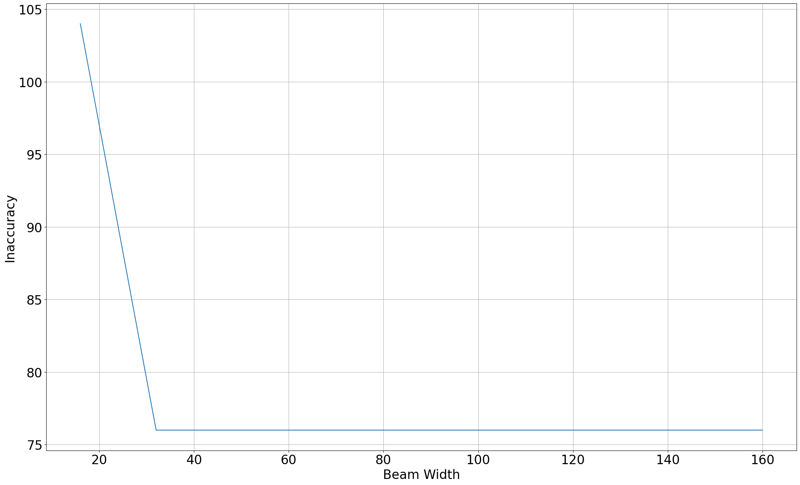
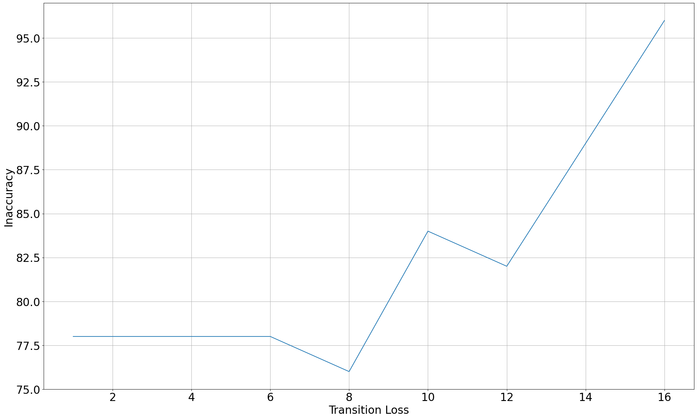

# Project 4 Report

## Lexical tree

We construct a trie structure for the lexical tree.

Each `TrieNode` represents a character. A node has a parent, a list of children, and an associated value. We use `None` in place of the children list to indicate that the node is a leaf node corresponding to the end of a word. We use `None` in place of the value for the dummy node prepended at the beginning of all words.

Leaf nodes and non-leaf nodes are distinguished within each node's children. We assign keys composed of whether the child node is a leaf node and the child node's value to the parent's children dictionary. This allows us to query either leaf or non-leaf nodes in $O(1)$.

### Debugging the trie

To check the correctness of the trie, we implemented a `__repr__` method to print the trie in a human-readable format. For example, one of the test cases is a trie containing the words `banana`, `bat`, `battle`, `a`, `an`, `and`, and `apple`. The trie is printed as follows:

```
Trie(len=7):
*─a
├─a─n
│ ├─n─d
│ └─p─p─l─e
└─b─a─n─a─n─a
    ├─t
    └─t─t─l─e
```

## Spell checking

In order to facilitate techniques similar to Levenshtein distance with dynamic programming, we employ a process of flattening the lexical tree. This involves transforming the tree structure into a linear sequence. For instance, the given tree:

```
*─b─a─n─a─n─a
    ├─t
    └─t─t─l─e
```

would be flattened as [root, b, a1, n, t1, t2, a2, t3, n2, l, a3, e]. Each node in the flattened structure is represented by a character, and connections between nodes are denoted by references. For example, 'b' points to 'a1', 'a1' points to 'n', 't', and 't', and so on.

During the process of generating the target word, we consider three possible operations at each character position:

1. Stay: The tree remains at the current position with loss `left_loss`.
2. Advance: The tree moves to the next layer or level with loss `diag_loss` if character does not match.
3. Skip: The tree skips that particular character with loss `down_loss`.

These loss parameters can be adjusted to find best result.

To traverse the trie and find the best match, we introduce a new data type called `LossNode`. Each `LossNode` contains the current loss value and references to the previous `LossNode` and `TrieNode`. During each round of traversal, we generate a list of `LossNode`s to keep track of the progress made during the search.

To improve efficiency and reduce computational complexity, we employ beam search for pruning at each round. This means that we only consider the `LossNode`s that have a loss value smaller than the minimum loss of the current round plus the specified beam width.



The plot above illustrates the relationship between beam width and inaccuracy counts. As the beam width decreases, the number of inaccuracies increases. This tradeoff between performance and correctness highlights the balance between achieving optimal performance and ensuring accuracy in the results.

### Backtracking

After obtaining an optimal loss at the end of the target word, we perform backtracking through the `LossNode` to identify the best matching string. This process involves iteratively finding the parent of the `TrieNode` associated with each `LossNode`. By utilizing linked lists, our implementation remains concise.

### Result

Raw type text:

```
onse apon a tyme wile gramadatta ws kng of benares th bohisata kame to lif t the foot of he himlays as ...
```

Ground truth text:

```
Once upon a time, while Brahmadatta was king of Benares, the Bodhisatta came to life at the foot of the Himalayas as ...
```

Corrected text:

```
one upon a time wide brahmadatta as ing of benares oh bodhisatta came to if a the foot of he hillas as a ...
```

The accuracy is Accuracy: 74.39%.

## Segmentation

For sentence segmentation, we utilize a modified approach based on spell checking. In this case, when a leaf node is reached, it points back to the root node. In addition to the existing three operations (Stay, Advance, and Skip), we introduce a new operation called "Transition", with a loss value of `transition_loss`. This modification enables us to adapt the spell checking procedure for sentence segmentation. The concept is similar to continuous speech recognition using Hidden Markov Models (HMMs). By leveraging this modified approach, we can achieve sentence segmentation with minimal adjustments to the spell checking mechanism.



The plot above depicts the relationship between transition loss and the accuracy of the results. The optimal transition loss alls in the middle.

### Result

We use a uniform approach for segmenting and segmenting with spellcheck.

For the unsgegmented correct text:

```
onceuponatimewhilebrahmadattawaskingofbenaresthebodhisattacametolifeatthefootofthehimalayasasa ...
```

Result:

```
once upon a time while brahmadatta was king of benares the bodhisatta came to life at the foot of the himalayas as a ...
```

Levenshtein distance between ground truth and the result is 2.

For the unsegmented typo text:

```
onseaponatymewilegramadattawskngofbenaresthbohisatakametoliftthefootofhehimlaysasa ...
```

Result:

```
on sea porath mew i le brahmadatta waking of benares the oh i sat a kamen to lilt the foot of he him ways as a ...
```

Levenshtein distance between ground truth and the result is 76.
