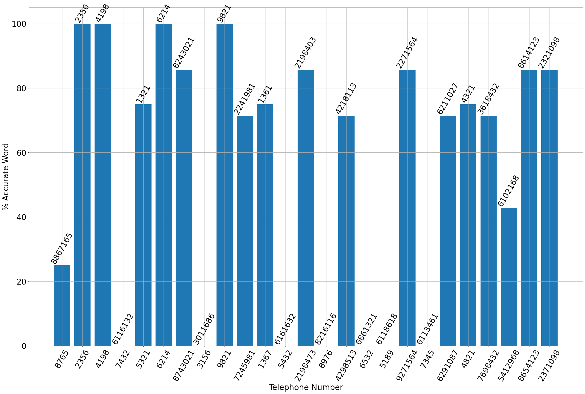
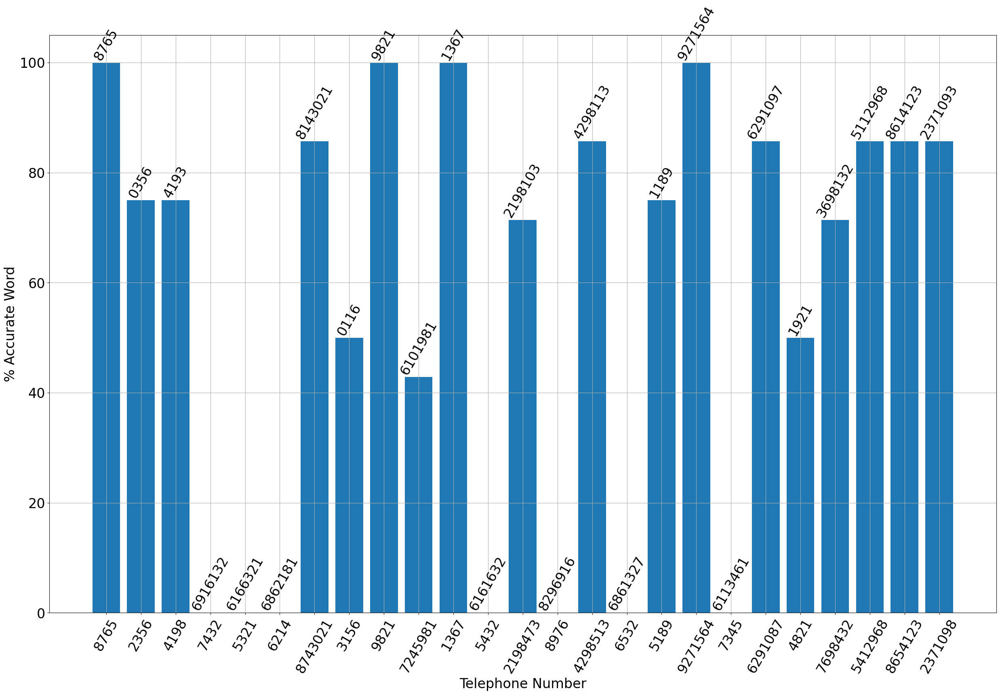
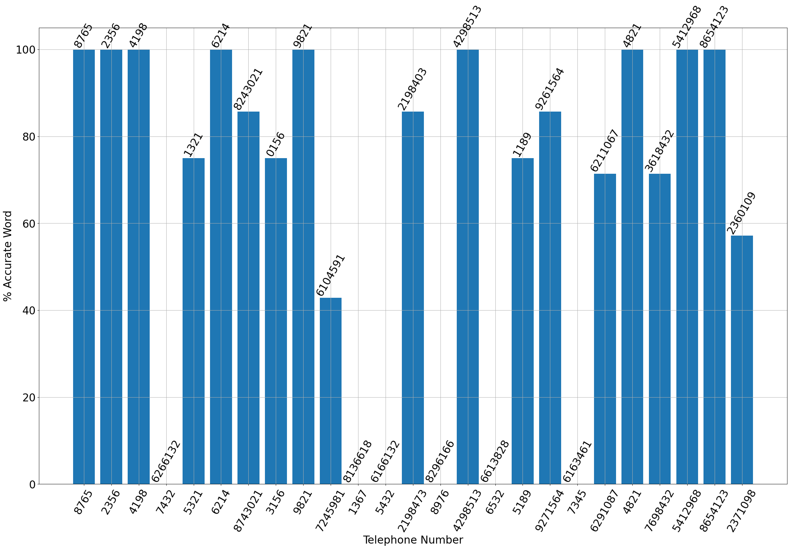
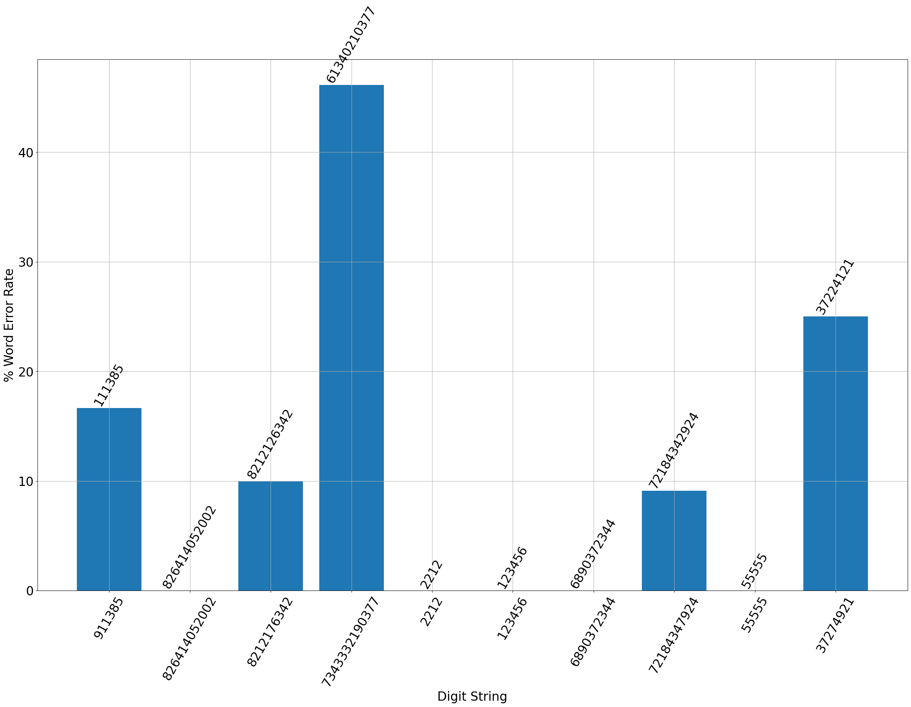

---
presentation:
  width: 1920
  height: 1080
---

<!-- slide -->

# COMPSCI 304 group project 5: From Single-Word to Multi-Word Speech Recognition

Steven Hé (Sīchàng), Luyao Wang

Instructor: Prof. Ming Li, Haoxu Wang

Duke Kunshan University

<!-- slide -->

### Contents

- Implementation
- Problem 1: phone number recognitoin
- Problem 2: unrestricted number recognitoin

<!-- slide -->

### Implementation

- Constructe a graph of HMM states by connecting the models trained in project 3
- Mimic the trie nodes in lexical trees in project 4
  - Each state in the HMMs corresponding to each digit as a node in the graph
  - Connect them to form a graph of HMM states
  - Transition loss from previous states to the current state for the ease of traversing the graph
  - Use the graph to recognize continuous speech, similar to spellchecking and segmentation with trie
<!-- slide -->

### Non-emitting state

To establish connections between two individual digits, we introduce a non-emitting state.

- Inserted between the last state of the previous digit and the
first state of the next digit
- Identical to the emitting states except that they do not contain
  - the label for a corresponding digit
  - parameters for the Gaussian mixtures
- Distinguish non-emitting states and process all of them before we match each MFCC feature vector against the emitting states
 

<!-- slide -->

### HMM states

- 10 possible digits to consider in each layer of digit HMMs
- A total of 50 states are associated with each layer with each digit consisting of 5 states
- For a 10-digit number with no constriant, our graph comprised 10 * 50 + 11 = 511 states.

<!-- slide -->

### Traverse the HMM state graph

- Similar to project 3, we traversed the feature sequence and updated the losses along the way.
- Need to account for the presence of the non-emitting state in this project
- Use a beam width to consider only losses smaller than minimum loss at this round plus beam width
- In our testing, a beam width of 4000 is good enough

<!-- slide -->

### Problem 1

Recognize telephone numbers consisting of either 3 or 7 digits

- We add an exit loss after the non-emitting state following the third position.
  - Allowed us to identify the end of a 3-digit number and initiate the recognition process.
- Introduce a silence HMM state following the third state.
  - This state helped improve the recognition accuracy by capturing pauses or breaks
  between digits.

<!-- slide -->

### Metrics

We measured the accuracy of our system using two metrics:

- Sentence accuracy
  - Percentage of correctly recognized whole sequences
- Average word accuracy
  - Percentage of individual digits correctly recognized
  - 1 - Levenshtein distance divided by the length of the target word

<!-- slide -->

### Result

1. Single HMM trained with 10 templates for each digit with 2 Gaussians:

    Sentence accuracy: 16.00%—4 telephone numbers were recognized correctly.
    Average word accuracy: 56.29%—74.0 digits were recognized correctly.

<!-- slide -->

### Result

2. Single HMM trained with 10 templates for each digit with 4 Gaussians:

    Sentence accuracy: 16.00%—4 telephone numbers were recognized correctly.
    Average word accuracy: 57.00%—78.0 digits were recognized correctly.

<!-- slide -->

### Result

3. Single HMM trained with 20 templates for each digit with 4 Gaussians:

    Sentence accuracy: 36.00%—9 telephone numbers were recognized correctly.
    Average word accuracy: 65.00%—86.0 digits were recognized correctly.

<!-- slide -->

### Result

- Increasing the number of Gaussians slightly increase the accuracy
- Using more training data significantly increase the accuracy
- The model has a tendency to recognize 4-digit numbers as
7-digit numbers due to a lack of transition loss between digits
- Struggles with the digit 7 and 9, presumably because of training data with less variation.

<!-- slide -->

### Problem 2

- The second problem did not impose any specific constraints,
allowing us to utilize the connected HMM state graph directly for recognition.

- Add an extra transition loss at the transition loss from the last digit HMM states to the non-emitting state

<!-- slide -->

### Empirical Optimal Transition Loss

- We use single digit HMMs trained with 20 templates and 4 Gaussians.
- We explored various transition losses and identified the transition loss that yielded the best results.

<!-- slide -->

### Result

Best transition loss: 385.0817700584015 Sentence accuracy: 50.00%.
Average word error rate: 10.69%.

<!-- slide -->

## Demo
