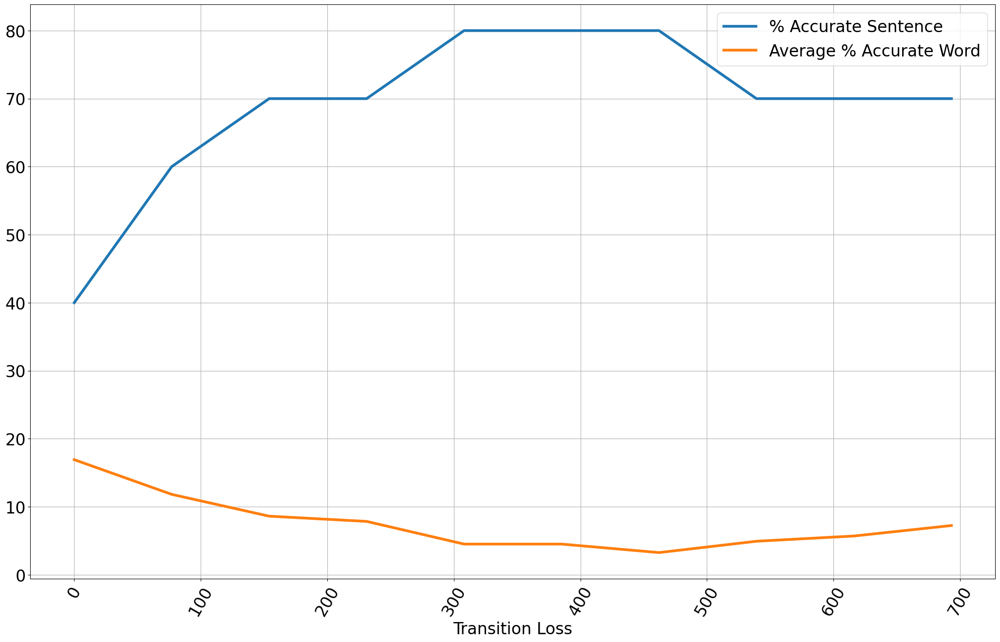

---
presentation:
  width: 1920
  height: 1080
---

<style>
.reveal img {
  max-height: 100vh;
}
</style>

<!-- slide -->

# COMPSCI 304 group project 6: Continuous Speech Training

Steven Hé (Sīchàng), Luyao Wang

Instructor: Prof. Ming Li, Haoxu Wang

Duke Kunshan University

<!-- slide -->

### Contents

- Implementation
- Alternatives
- Problem 1: phone number recognitoin
- Problem 2: unrestricted number recognitoin

<!-- slide -->

### Implementation

1. Initialize the Hidden Markov Model (HMM) with isolated word features.

2. Proceed to segment the continuous speech feature vectors by connecting the HMM states. This segmentation
process divides the continuous speech feature vectors into separate parts, each corresponding to a specific digit.

3. Use the separated digit feature vectors, along with the original isolated word features used in step 1,
to train new isolated word HMMs.

4. If convergence is not achieved (i.e., the alignment of continuous speech feature vectors for each
digit does not remain unchanged), return to step 2.

<!-- slide -->

### Alternatives

We brainstormed some alternative approaches:

1. Each HMM state stores a set of groups of associated features,
    which are updated each round.
2. Change the means, variances, and transition losses of each state each round.
3. Aggregate the means, variances, and transition losses of training output from all sequences.

The first approach is too complicated, and the two latter approaches may not converge.

<!-- slide -->

### Training With Continuous Speech

- Train 4-Gaussian continuous speech model with
  - 20 isolated templates
  - 6 $\times$ 5 continuous templates
- Takes around 17 minutes, and 10 iterations to converge

Log of the difference of feature segmenting in each round:

The first round does not have a previous alignment to show the difference

```sh
Diff: 222, Total: 300
Diff: 75, Total: 300
Diff: 66, Total: 300
Diff: 25, Total: 300
Diff: 16, Total: 300
Diff: 26, Total: 300
Diff: 22, Total: 300
Diff: 23, Total: 300
Diff: 0, Total: 300
```

</br>

<!-- slide -->

### Telephone Number Recognition Results: Previous

Single HMM trained with 20 templates for each digit with 4 Gaussians.

Sentence accuracy: 36.00%—9 telephone numbers were recognized correctly.
Average word accuracy: 65.00%—86.0 digits were recognized correctly.


<!-- slide -->

### Telephone Number Recognition Results: New

The new results are much improved:

Sentence accuracy: 68.00%—17 telephone numbers were recognized correctly.
Average word accuracy: 85.71%—113.0 digits were recognized correctly.


<!-- slide -->

### Unrestricted Digit String Recognition Results: Transition Loss

Similar to project 5, we explored different transition losses and determined the one that produced the best outcomes.

<div style="display: flex;">
    
    

</div>

Left: previous, Right: new

<!-- slide -->

### Unrestricted Digit String Recognition Results: Previous


<!-- slide -->

### Unrestricted Digit String Recognition Results: New

The recognition result from this project, as depicted below, demonstrates a substantial improvement.


<!-- slide -->

## Demo
